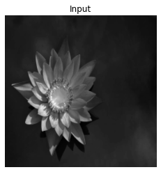
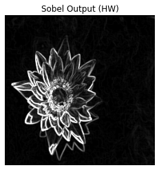

# FPGA Sobel Edge Detector (AXI-Stream + DMA + PYNQ)

Hardware-accelerated Sobel edge detector implemented using Vitis HLS and deployed on a PYNQ-Z2 platform.  
The design streams 256×256 grayscale images through AXI-DMA into a custom HLS IP core using a 3×3 sliding window architecture with line buffers.

This project was later extended to support **real-time video output via HDMI using AXI-VDMA**, enabling dynamic framebuffer rendering and animation.

---

## Project Overview

This project implements a hardware Sobel edge detector using:

- Vitis HLS (C++ → RTL)
- AXI-Stream interfaces
- AXI-DMA (MM2S + S2MM)
- AXI-VDMA (video output pipeline)
- Vivado Block Design
- PYNQ Python control

The system processes full images via streaming and returns the computed gradient magnitude, and supports real-time display via HDMI.

---

## Architecture

### HLS IP Core

- AXI-Stream input/output (`ap_axiu<8>`)
- 3×3 sliding window
- Two line buffers (BRAM inferred)
- Pipelined with II=1
- Output: `|Gx| + |Gy|` clipped to 255
- TLAST asserted on final pixel

### Sobel Kernels

Gx =
[ -1   0   1  
  -2   0   2  
  -1   0   1 ]

Gy =
[ -1  -2  -1  
   0   0   0  
   1   2   1 ]

---

## Vivado Block Design

### DMA-Based Processing Pipeline

- Zynq PS
- AXI DMA
- Custom Sobel HLS IP
- Shared clock: `FCLK_CLK0`
- Reset: `peripheral_aresetn`

**Configuration:**

- Stream data width: 8-bit
- Memory-mapped width: 32-bit
- Scatter-Gather: Disabled
- Single channel DMA

### HDMI Video Pipeline

- AXI VDMA (MM2S)
- Video Timing Controller (VTC)
- AXI4-Stream to Video Out
- RGB2DVI encoder

**Configuration:**

- Resolution: 640×480 @ 60 Hz
- Pixel clock: 25 MHz
- Stream width: 24-bit (RGB)
- Triple buffering enabled

### DMA Execution Order

1. Start Sobel IP
2. Start S2MM (receive channel)
3. Start MM2S (send channel)
4. Wait for completion

---

## Software Control (PYNQ)

Python notebooks perform:

- Bitstream loading
- DMA / VDMA buffer allocation (DDR)
- Cache flush/invalidate handling
- Transfer synchronization
- Framebuffer generation and animation
- Output visualization

Supported formats:

- PGM (P5, 8-bit)
- PNG/JPG (converted to grayscale)

---

## Results

### Sobel Edge Detection (Hardware)

| Input | Output |
|------|--------|
|  |  |

Edge detection correctly highlights object boundaries using real hardware acceleration.

### HDMI Output (Real-Time)

- Live framebuffer rendering on monitor
- Moving object animation using Python-controlled updates
- VDMA circular buffering with multiple frame stores

👉 Demo:  
[Watch HDMI animation](media/moving_square.mp4)

---

## Repository Structure

/images/        → Input/output examples  
/media/         → HDMI demo videos  
/notebooks/     → PYNQ control notebooks  
/src/           → HLS source code  
/vivado/        → Block designs  
/sobel_hw_stream/ → HLS IP export  
README.md  

---

## Key Technical Points

- Fully streaming architecture (no full-frame buffering)
- Sliding window + BRAM line buffers
- II=1 pipeline
- Correct TLAST handling for DMA stability
- AXI DMA ↔ AXI VDMA integration
- Framebuffer management in DDR
- Triple buffering for video output
- Clock domain separation (AXI vs pixel clock)

Debugged issues:

- AXI-DMA handshake and stalls
- VDMA frame store configuration
- HDMI timing mismatches
- Pixel clock generation and reset synchronization

- Verified via:
  - HLS C simulation
  - RTL simulation
  - On-board hardware validation

---

## Future Improvements

- Real-time Sobel processing on HDMI video stream
- RGB → grayscale conversion in hardware
- Parameterizable image size
- Runtime-configurable kernel
- Throughput benchmarking
- AXI4-Lite configuration registers for dynamic control
- UVM-based verification (RTL version)
