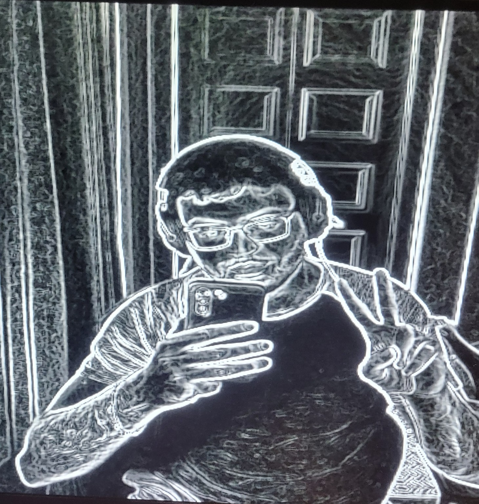

# FPGA Sobel Edge Detector (Real-Time HDMI Pipeline)

Hardware-accelerated Sobel edge detection implemented on a PYNQ-Z2 (Zynq-7000 SoC) using Vitis HLS, AXI-Stream, AXI DMA/VDMA, and HDMI output.

The project evolved from offline image processing (DMA) to a real-time video processing pipeline, where frames from a USB camera are processed in hardware and displayed live via HDMI.

---

## Key Features

- Real-time edge detection on live camera feed  
- Fully streaming architecture (1 pixel per clock, II=1)  
- AXI-based system integration (DMA, VDMA, AXI4-Stream)  
- Hardware/software co-design (PS + PL)  
- HDMI output with Video Timing Controller (VTC)  
- HLS-based accelerator with line-buffer architecture  

---

## System Architecture

USB Camera (PS / Linux)  
→ OpenCV (frame capture, resize, RGB conversion)  
→ DDR Framebuffer  
→ AXI VDMA (MM2S)  
→ Sobel HLS IP (AXI-Stream)  
→ AXI4-Stream to Video Out  
→ RGB2DVI  
→ HDMI Monitor  

---

## Sobel HLS IP

### Architecture

- AXI-Stream input/output (24-bit RGB)  
- Internal grayscale conversion  
- 3×3 sliding window  
- Dual line buffers (BRAM)  
- Fully pipelined (II = 1)  

### Sobel Kernels

```
Gx = [ -1   0   1
       -2   0   2
       -1   0   1 ]

Gy = [ -1  -2  -1
        0   0   0
        1   2   1 ]
```

### Output

- Gradient magnitude: |Gx| + |Gy|  
- Clipped to 8-bit  
- Replicated to RGB for HDMI display  

---

## HDMI Output Configuration

- Resolution: 640 × 480 @ 60 Hz  
- Pixel clock: 25 MHz  
- AXI4-Stream video pipeline  
- Triple buffering via VDMA  
- Reset synchronization across clock domains  

---

## DMA-Based Version (Offline Processing)

DDR → AXI DMA → Sobel IP → AXI DMA → DDR  

Used for:

- Validating Sobel correctness  
- Debugging AXI-Stream behavior  
- Testing TLAST and frame handling  

---

## Results

### Offline Sobel (DMA)

  


---

### Real-Time HDMI Sobel

Live USB camera processed in hardware:



Demo video:  
media/real_time_application.mp4

---

## Software Control (PYNQ)

Python (Jupyter) is used for:

- USB camera capture (OpenCV)  
- Frame resizing (640×480)  
- BGR to RGB conversion  
- Framebuffer writes to DDR  
- VDMA configuration via MMIO  

---

## Repository Structure

```
images/
  ├── sobel_frame/
  └── hdmi_real_time/

media/
  └── real_time_application.mp4

notebooks/
  ├── DMA_notebooks/
  └── hdmi/

src/
  ├── dma_sobel/
  └── hdmi_sobel/

ip/
  ├── sobel_dma/
  └── sobel_stream/

vivado/
  ├── dma_sobel_pipeline.bd
  └── hdmi_sobel_pipeline.bd
```

---

## Key Technical Challenges

- AXI-Stream protocol correctness (TVALID, TLAST, TUSER)  
- DMA and VDMA integration  
- Clock domain crossing (PS clock vs pixel clock)  
- Reset synchronization across domains  
- Real-time framebuffer consistency  
- HLS IP packaging issues (Vivado 2020.2 workaround)  

---

## Future Improvements

- RGB Sobel (per-channel processing)  
- Higher resolution (720p / 1080p)  
- Double buffering to reduce tearing  
- AXI-Lite configurable parameters  
- RTL Sobel implementation  
- UVM-based verification  

---

## Technologies Used

- Vitis HLS (C++ → RTL)  
- Vivado (Block Design)  
- PYNQ (Python + MMIO)  
- OpenCV  
- AXI DMA / AXI VDMA / AXI4-Stream  
- Zynq-7000 SoC  

---

## Summary

This project demonstrates a complete real-time FPGA video processing system combining hardware acceleration, streaming architecture, and embedded Linux interaction.
